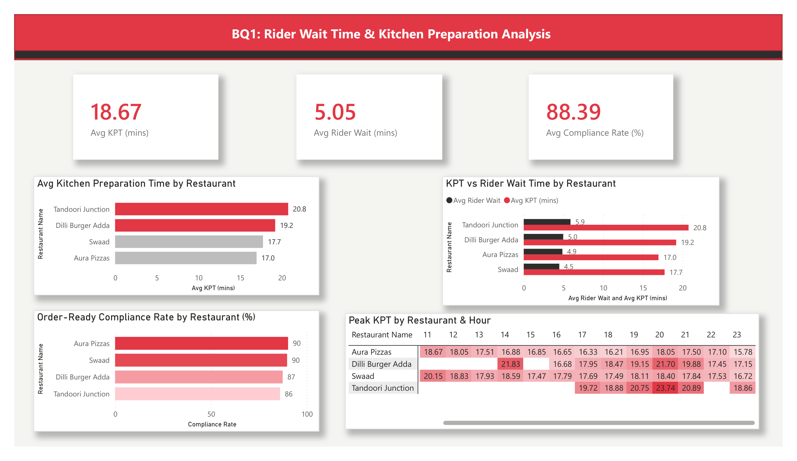
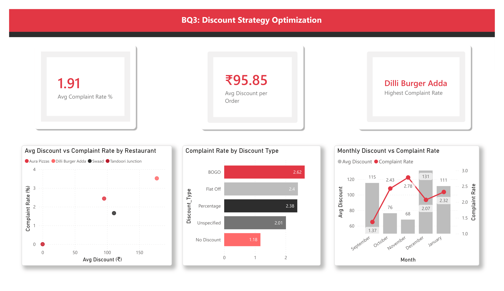

# 🍽️ Zomato Food Delivery Analysis

### Operational Efficiency, Basket Dynamics & Discount Optimization

---

<h2>📌 Project Overview</h2>

This project analyzes <b>21,321 food delivery transactions</b> from Zomato to uncover
operational bottlenecks, customer ordering behavior, and promotional strategy effectiveness.

Using <b>Python</b> for data preprocessing and <b>Power BI</b> for dashboard development,
the analysis generates actionable recommendations to improve operational efficiency,
increase revenue, and optimize discount strategies.

---

<h2>🎯 Business Objectives</h2>

<ul>
<li>Evaluate Kitchen Preparation Time (KPT) and Rider Wait Time dynamics.</li>
<li>Analyze customer basket composition and revenue opportunities.</li>
<li>Assess the impact of promotional campaigns on customer complaints.</li>
<li>Develop data-driven business recommendations.</li>
</ul>

---

<h2>📊 Dataset Summary</h2>

<table>
<tr>
<th>Metric</th>
<th>Value</th>
</tr>

<tr>
<td>Total Orders</td>
<td>21,321</td>
</tr>

<tr>
<td>Analysis Period</td>
<td>5 Months</td>
</tr>

<tr>
<td>Features</td>
<td>29 Columns</td>
</tr>

<tr>
<td>Industry</td>
<td>Food Delivery</td>
</tr>

</table>

---

<h2>🛠️ Tools & Technologies</h2>

---

<h2>📂 Project Structure</h2>

<pre>
Zomato-Food-Delivery-Analysis
│
├── Data
│   └── zomato_dataset.csv
│
├── PowerBI
│   ├── BQ1_Operational_Efficiency.pbix
│   ├── BQ2_Basket_Analysis.pbix
│   └── BQ3_Discount_Optimization.pbix
│
├── Notebooks
│   └── Data_Preprocessing.ipynb
│
├── Images
│   ├── Dashboard_1.png
│   ├── Dashboard_2.png
│   └── Dashboard_3.png
│
└── README.md
</pre>

---

<h2>📈 Business Question 1</h2>

<h3>Operational Efficiency & Kitchen Dynamics</h3>

<table>
<tr>
<th>KPI</th>
<th>Value</th>
</tr>

<tr>
<td>Average KPT</td>
<td>18.67 Minutes</td>
</tr>

<tr>
<td>Average Rider Wait Time</td>
<td>5.05 Minutes</td>
</tr>

<tr>
<td>Correlation (KPT vs Wait Time)</td>
<td>0.45</td>
</tr>

</table>

<h4>Key Insights</h4>

<ul>
<li>Higher preparation times directly increase rider idle durations.</li>
<li>Dinner rush hours create the largest operational bottlenecks.</li>
<li>Order-ready compliance strongly impacts dispatch efficiency.</li>
</ul>

---

<h2>🛒 Business Question 2</h2>

<h3>Basket Size & Revenue Analysis</h3>

<table>
<tr>
<th>Metric</th>
<th>Value</th>
</tr>

<tr>
<td>Single Item Orders</td>
<td>45.2%</td>
</tr>

<tr>
<td>Potential Revenue Gain per Upsell</td>
<td>Rs. 214</td>
</tr>

<tr>
<td>Peak Basket Value Time</td>
<td>11:00 AM</td>
</tr>

</table>

<h4>Top Product Pairings</h4>

<table>
<tr>
<th>Item 1</th>
<th>Item 2</th>
<th>Frequency</th>
</tr>

<tr>
<td>Bageecha Pizza</td>
<td>Chilli Cheese Garlic Bread</td>
<td>484</td>
</tr>

<tr>
<td>Bageecha Pizza</td>
<td>Makhani Paneer Pizza</td>
<td>371</td>
</tr>

</table>

---

<h2>💰 Business Question 3</h2>

<h3>Discount Strategy & Complaint Analysis</h3>

<table>
<tr>
<th>Promotion Type</th>
<th>Complaint Rate</th>
</tr>

<tr>
<td>No Discount</td>
<td>1.18%</td>
</tr>

<tr>
<td>BOGO</td>
<td>2.62%</td>
</tr>

</table>

<h4>Key Finding</h4>

Higher promotional spending was associated with increased customer complaints,
suggesting that aggressive discounting may negatively impact operational quality.

---

<h2>📸 Dashboard Previews</h2>

<h3>Operational Efficiency Dashboard</h3>

  

<h3>Basket Analysis Dashboard</h3>

  

<h3>Discount Optimization Dashboard</h3>

---

<h2>🚀 Strategic Recommendations</h2>

<ol>
<li><b>Dynamic Rider Dispatching</b> based on kitchen congestion.</li>
<li><b>Automated Cross-Selling</b> using item affinity analysis.</li>
<li><b>BOGO Replacement Strategy</b> with margin-friendly bundles.</li>
<li><b>Promotion Smoothing</b> to reduce complaint volatility.</li>
</ol>

---

<h2>📌 Key Outcomes</h2>

<ul>
<li>✅ Identified operational bottlenecks affecting delivery efficiency.</li>
<li>✅ Quantified revenue opportunities through basket expansion.</li>
<li>✅ Evaluated the impact of discounts on customer satisfaction.</li>
<li>✅ Developed actionable business recommendations.</li>
</ul>

---

⭐ If you found this project interesting, consider giving it a star.

